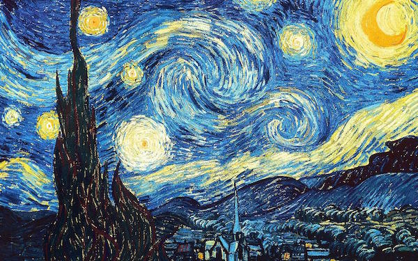
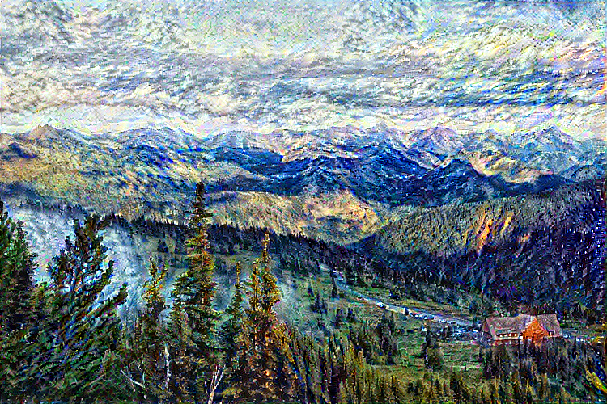
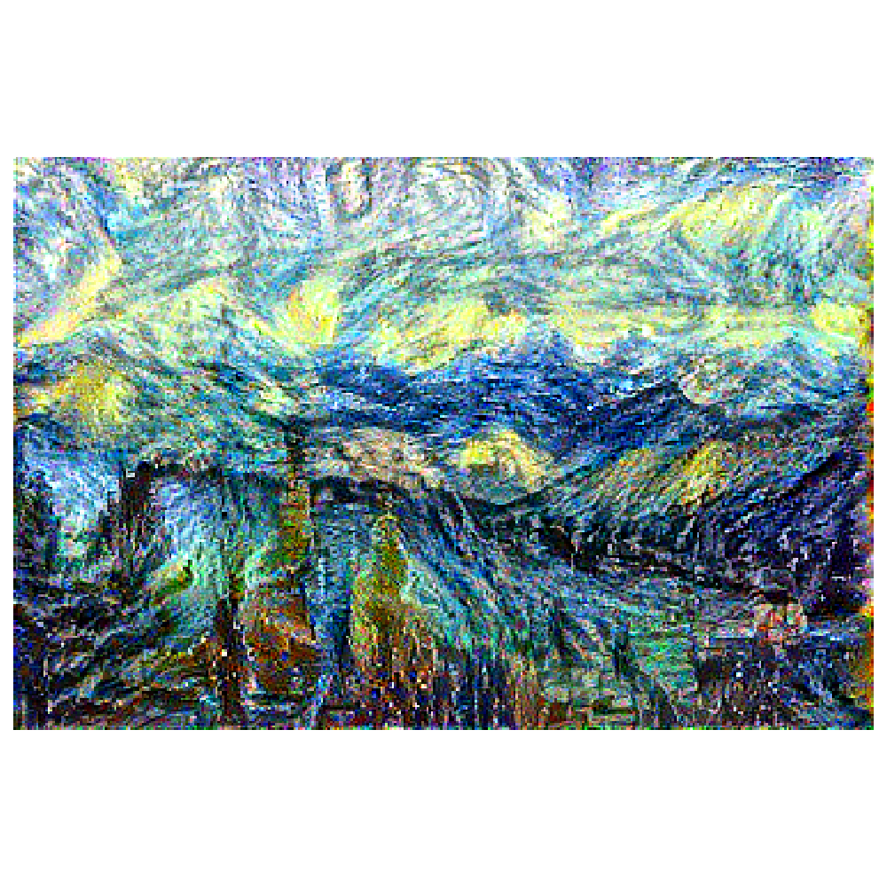
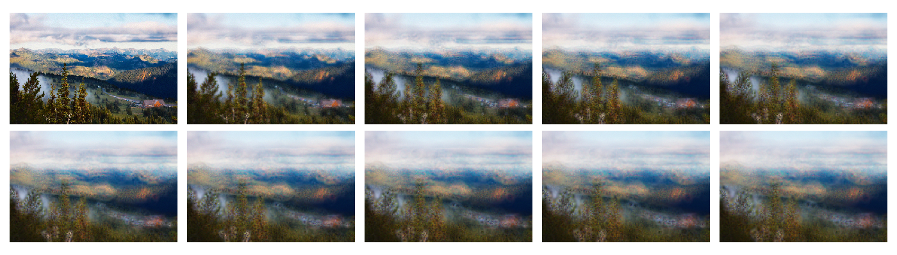
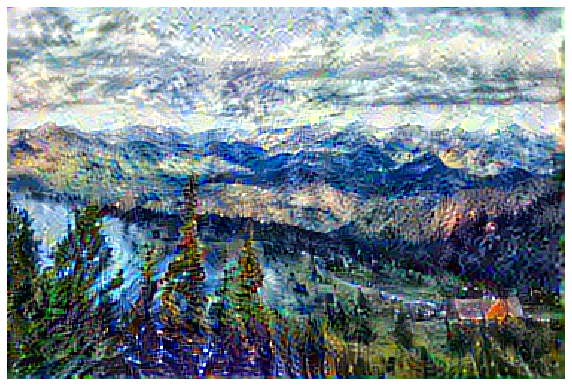
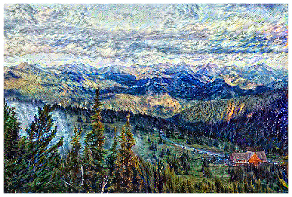
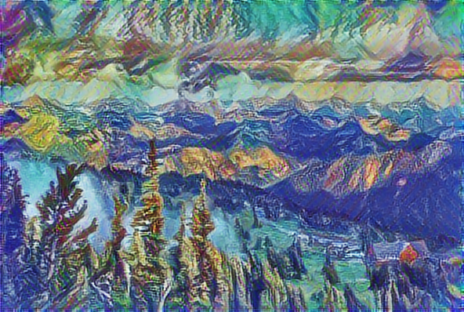

# image-processing
image processing class homework

## 1: Image Manipulate

* basic MATLAB
* nearest_neighbor
* bilinear_interpolation

## 2: Noise and Filters

1. Noise 
	* gaussian_noise
	* salt_and_pepper
	* salt && pepper
	* poisson_noise
	* mean_noise
2. Filters
	* arithmetic_mean
	* geometric_mean
	* harmonic_wave_mean
	* reverse_harmonic_wave_mean
	* median_filter
	* max_filter
	* min_filter
	* middle_filter
	* revision_alpha
	* adaptive_mean

## 3:  Fit Line

* least_squares
* ransac
* hough_transform
* find  edge line in a image

## 4: Project: Neural Style Transfer

#### Input

#### Normal

#### Normal With High Style Weight

#### With Sobel Hight Total Variation Weight

#### With Sobel Low Total Variation Weight

#### Final Normal With Sobel

#### Fast Style Transfer(base on Tensorflow hub)

## Reference

[A Neural Algorithm of Artistic Style](https://arxiv.org/pdf/1508.06576.pdf)

[综述：图像风格化算法最全盘点 ](https://www.jiqizhixin.com/articles/2018-05-15-5)

https://github.com/raskutti/examples/blob/master/community/en/neural_style_transfer/neural_style_transfer.ipynb

https://www.tensorflow.org/tutorials/generative/style_transfer

[Gram Matrices理解](https://blog.csdn.net/tunhuzhuang1836/article/details/78474129)

[[译] Perceptual Losses for Real-Time Style Transfer and Super-Resolution（Stanford University）](https://cloud.tencent.com/developer/article/1125595)

[Neural-Style-Transfer-Papers](https://github.com/ycjing/Neural-Style-Transfer-Papers)

[TensorFlow之深入理解Fast Neural Style](https://zhuanlan.zhihu.com/p/30486310)

[deeplearning.al 卷积神经网络课程](https://www.coursera.org/specializations/deep-learning)

[动手学深度学习课程](http://zh.d2l.ai/chapter_computer-vision/neural-style.html)

[Understanding your Convolution network with Visualizations](https://towardsdatascience.com/understanding-your-convolution-network-with-visualizations-a4883441533b)

